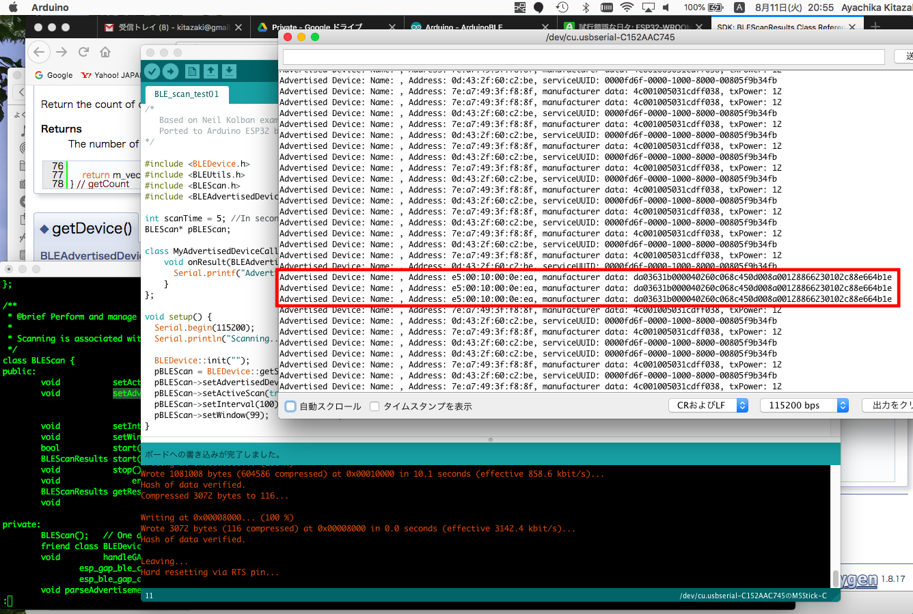

# ESP32_BLE_Arduino

pBLEScan->setAdvertisedDeviceCallbacks(new MyAdvertisedDeviceCallbacks());  
↓  
pBLEScan->setAdvertisedDeviceCallbacks(new MyAdvertisedDeviceCallbacks(), true);  // duplicate packet

